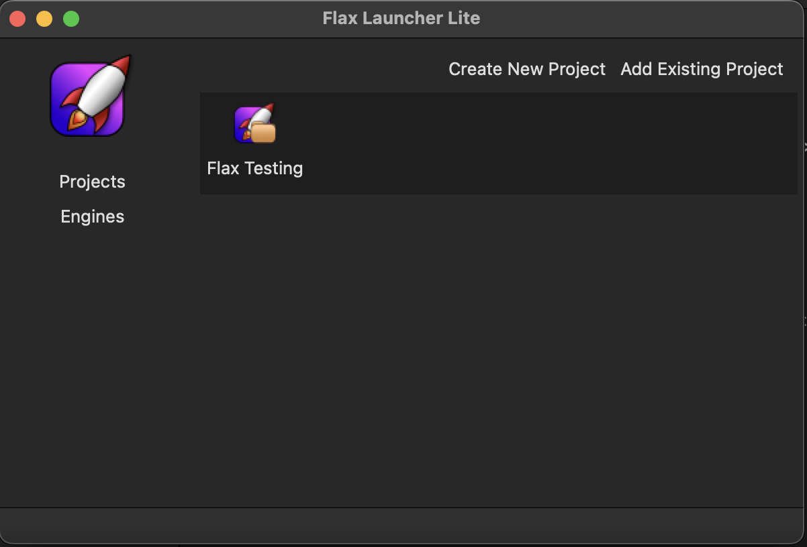
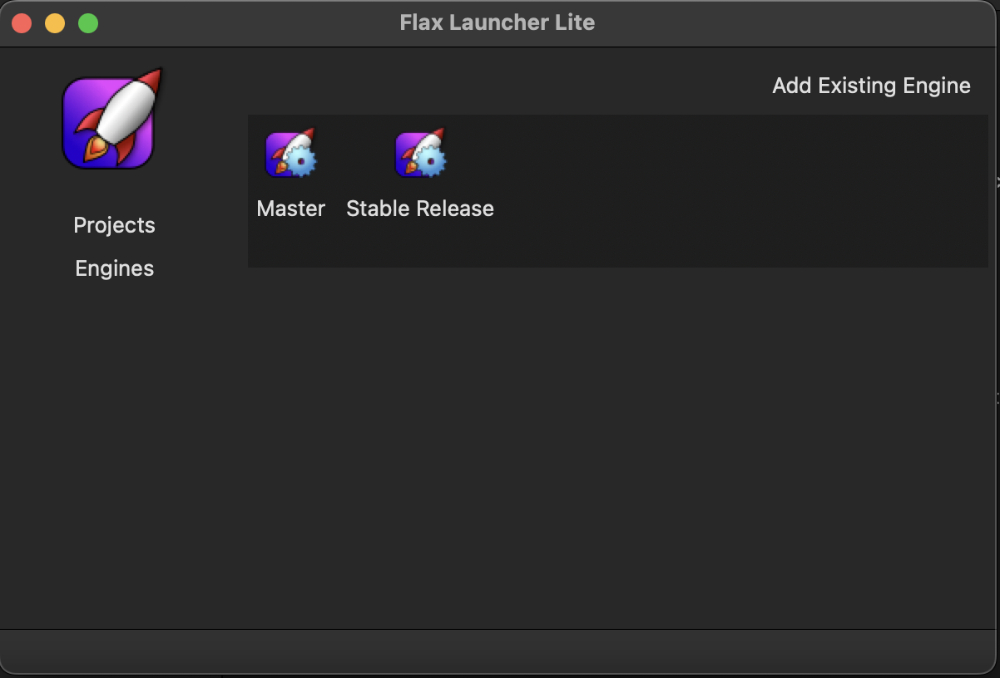
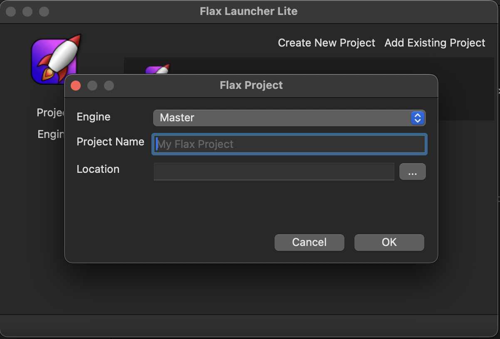
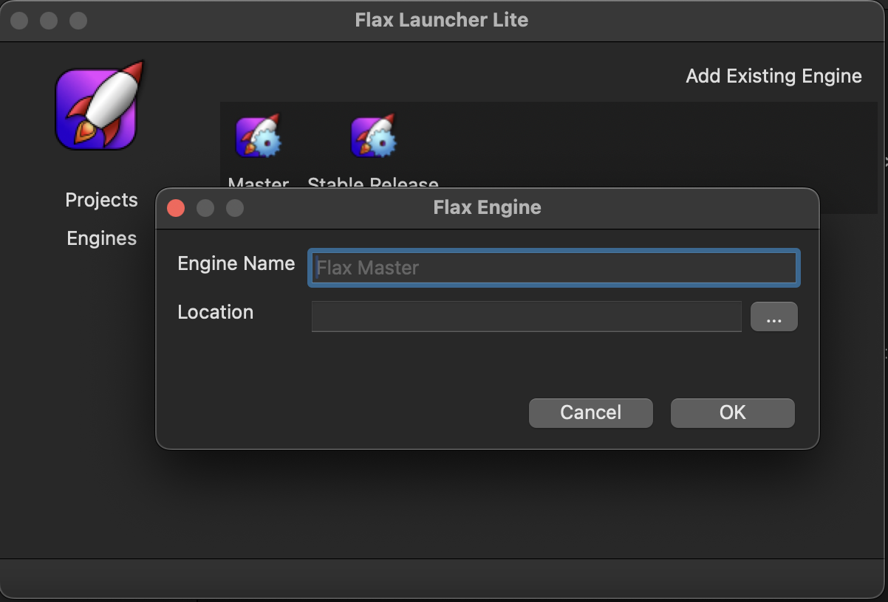

# FlaxLauncherLite #

## This project is very experimental! No checks to validate the existance of the engines/projects are made.
Errors should be expected! ##

Flax Launcher Lite is a Flax Engine launcher for MacOS, Linux and Windows. It is a very first pass and
has only been compiled and tested under MacOS. This launcher has only the most basic features. It allows:

- Adding Flax Engine versions to the Engine list
- Adding Existing Flax projects to the Project list
- Creating a new Flax Project with the chosen engine

This project was created since the current Flax Launcher only works under Windows. It was created using wxWindows
and _should_ be protable to all desktop platforms.

## Instructions ##

First, an engine needs added to the list of engines. Choose *Add Existing Engine* from the *Engines* section and
choose a name for the engine and the path to the FlaxEditor for that engine.

Next, either an existing Flax project can be added or a new project created. To add an existing project,
choose *Add Existing Project* from the *Projects* section. Chose the engine for the project, a name for the project
and the <project>.flaxproj file that represents the project.

To create a new Flax project choose the *Create New Project* option. Select the engine, enter a project name and
shoose a project location. After that is complete, the project will be created in the chosen location on disk
using the name specified. The Faxl Editor should launch afterwards.

## Launching a project ##

To launch a project, click on the project to launch, right-click it and choose *Launch from the context menu.

## Deleteing a Project or Engine ##

To delete a project or engine, click on the item, then right-click and choose *Delete" from the context menu. A
confirmation dialog will confirm the choice. _*Note:* the project or engine are only removed from the launcher,
and will *not* be deleted from the disk._

## Screenshots ##

The Project List:

The Engine List:

The Create New Project Dialog:

The Add Engine Dialog:
